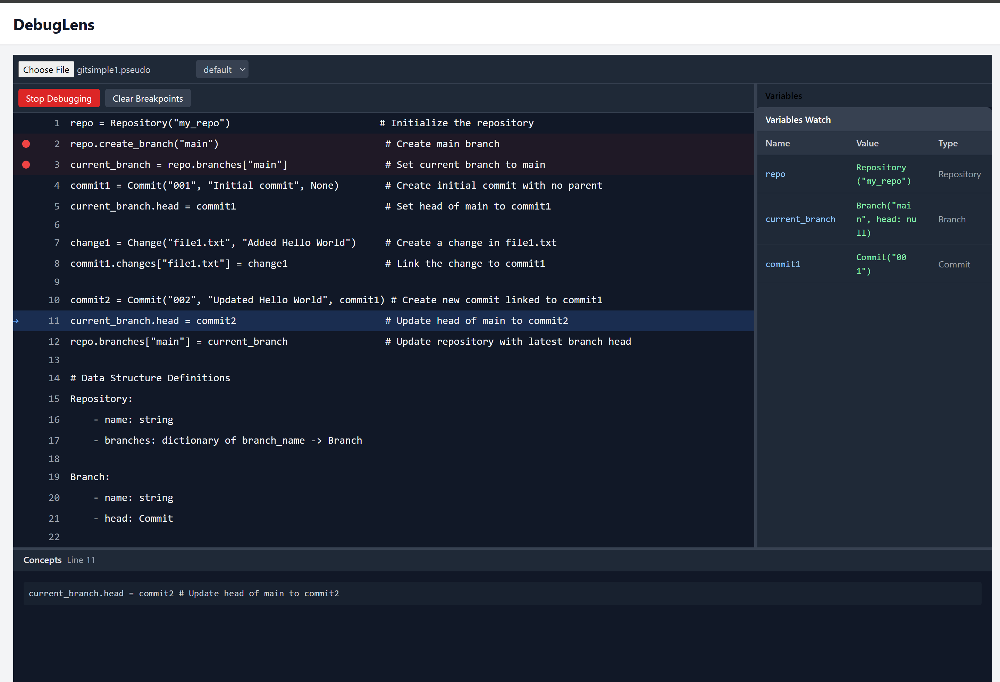

# DebugLens

An AI-powered code debugging and visualization tool that helps developers understand code behavior through abstract representation and analysis.

## Overview

DebugLens is a debugging tool that provides:

- Visual representation of code execution
- Abstract code analysis
- Step-by-step code behavior tracking
- Real-time variable state monitoring

## Technical Details

The tool provides debugging capabilities for Python code with features like:

- Abstract syntax tree analysis
- Runtime state inspection
- Data structure visualization
- Type inference and tracking

## Example Use Case

In the demonstrated example, the tool is debugging a Git-like version control implementation, showing:

- Repository and branch management operations
- Commit creation and linking
- Change tracking
- Data structure definitions and relationships

## Purpose

DebugLens aims to:

- Make code behavior more understandable
- Provide visual insights into program execution
- Help developers track complex state changes
- Facilitate learning through visual debugging

## Target Users

- Developers debugging complex code
- Students learning programming concepts
- Code reviewers understanding new codebases
- Anyone wanting to visualize code execution

## Note

This tool focuses on abstract representation and understanding of code behavior, rather than traditional debugging features alone. It's designed to make code comprehension more intuitive through visual and AI-assisted analysis.
