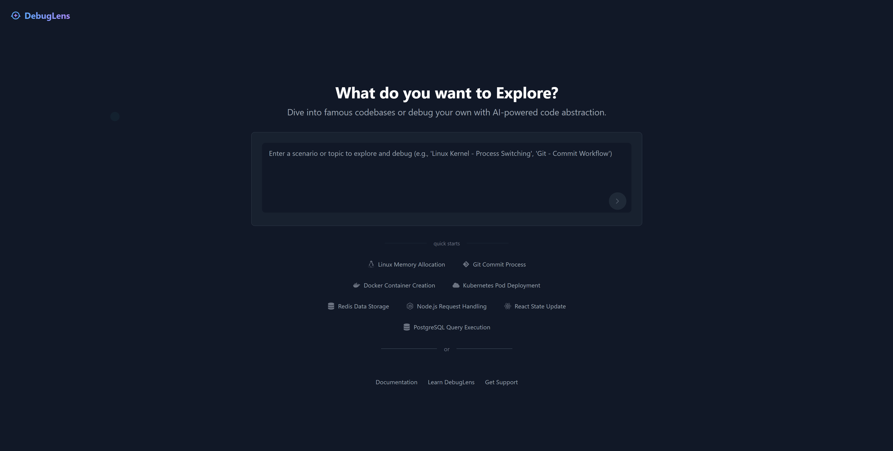

# DebugLens

An AI-powered code debugging and visualization tool that helps developers understand code behavior through abstract representation and analysis.

## Overview

DebugLens is a debugging tool that provides:

- Visual representation of code execution
- Abstract code analysis
- Step-by-step code behavior tracking
- Real-time variable state monitoring

## Features

### Interactive Debugging Interface

- File selection with dropdown menu
- Breakpoint management
- Step-by-step execution control
- Stop/Clear debugging controls

### Variable Watch

- Real-time variable state tracking
- Type information display
- Value visualization
- Structured data representation

### Code Visualization

- Line-by-line execution highlighting
- Comment annotations for better understanding
- Clear visualization of code structure
- Concept explanation for selected lines

### Data Structure Visualization

- Abstract representation of complex data structures
- Clear display of object relationships
- Type definitions and hierarchies
- Dynamic updates during execution

## Technical Details

The tool provides debugging capabilities for Python code with features like:

- Abstract syntax tree analysis
- Runtime state inspection
- Data structure visualization
- Type inference and tracking

## Example Use Case

In the demonstrated example, the tool is debugging a Git-like version control implementation, showing:

- Repository and branch management operations
- Commit creation and linking
- Change tracking
- Data structure definitions and relationships

## Purpose

DebugLens aims to:

- Make code behavior more understandable
- Provide visual insights into program execution
- Help developers track complex state changes
- Facilitate learning through visual debugging

## Interface Components

1. **File Selection Area**

   - Choose File button
   - Default configuration dropdown

2. **Debug Controls**

   - Stop Debugging button
   - Clear Breakpoints option

3. **Code View**

   - Line numbers
   - Execution highlights
   - Breakpoint indicators
   - Inline comments

4. **Variables Panel**

   - Name column
   - Value display
   - Type information
   - Structured data visualization

5. **Concepts Panel**
   - Line-specific explanations
   - Code behavior insights
   - Context-aware documentation

## Target Users

- Developers debugging complex code
- Students learning programming concepts
- Code reviewers understanding new codebases
- Anyone wanting to visualize code execution

## Note

This tool focuses on abstract representation and understanding of code behavior, rather than traditional debugging features alone. It's designed to make code comprehension more intuitive through visual and AI-assisted analysis.
